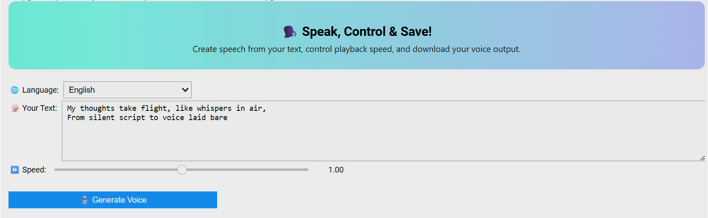
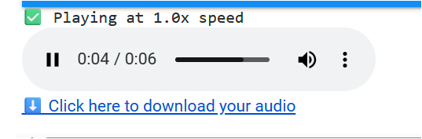
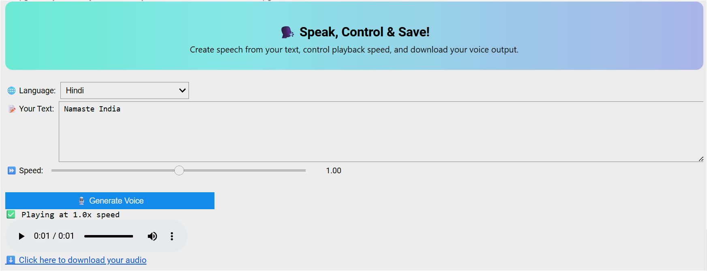

# 🎤 Voice Generator with gTTS using Python
A sleek Google Colab app that converts your thoughts into speech—powered by gTTS and pydub. Supports Hindi and English input, adjustable playback speed, and MP3 downloads. 

[](https://colab.research.google.com/drive/1FcmCG2SOW0WgqvCsDZAi5BuBEXvXIgFQ?usp=sharing)

---

## 📦 Features

- 🗣️ Text-to-speech using Google's gTTS
- 🌐 Multilingual support: Hindi & English
- ⏩ Playback speed control (0.5x to 1.5x)
- 🔊 In-browser audio playback
- 💾 One-click MP3 download
- 🎨 Stylish and interactive UI using `ipywidgets`

---

## 🔎 Preview

Here’s a look at the voice generator in action:

  
*Main interface showing language selection and input controls*

  
*Output audio with speed control and playback*

  
*Main interface showing language selection and input controls*

---

## 🚀 How to Use

1. Open the Colab notebook:
   [👉 Launch on Google Colab](https://colab.research.google.com/drive/1FcmCG2SOW0WgqvCsDZAi5BuBEXvXIgFQ?usp=sharing)
2. Run all code cells
3. Type your message in the text box
4. Choose your preferred language and speech speed
5. Click “🎙️ Generate Voice” to listen and download!

---

## 🛠️ Setup (For Local Use)

```bash
pip install gTTS pydub ipywidgets
sudo apt install ffmpeg
